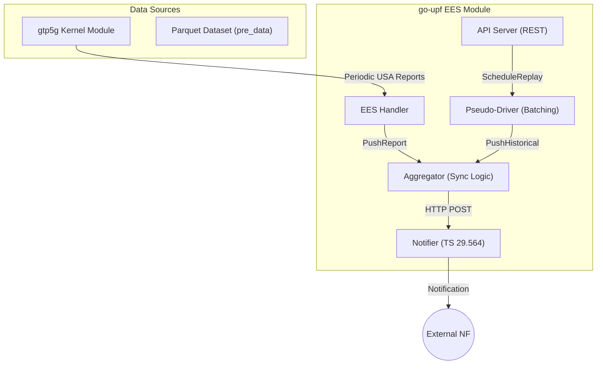
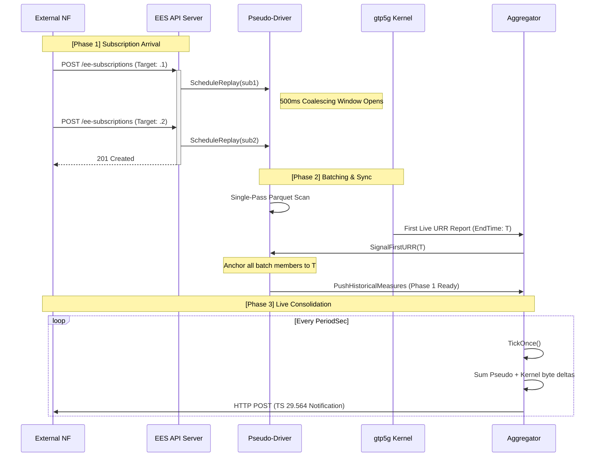

# UPF Event Exposure Service (EES) - Data Processing Flow

This document details the architectural design and data processing workflows of the **Nupf_EventExposure** service implemented in `go-upf`. The design follows a **Hybrid Parallel Model**, integrating live kernel telemetry with historical simulated data.

---

## Architecture Overview

The EES is implemented as a modular component within `go-upf`, utilizing a **Batch-Broadcaster** pattern for historical data and a **Pure Push** model for live kernel reports.

### System Components

---

## Data Processing Workflow

The EES workflow is structured into five sequential phases to ensure deterministic synchronization and high-throughput data handling.

### [1] Configuration and Initialization
The module is activated via the `ees` section of the UPF configuration.
*   **Worker Startup**: The Aggregator and API server are initialized.
*   **Dataset Mapping**: The Pseudo-Driver maps the Parquet directory for historical replay.

**Core Functions:**
*   `NewAggregator()`: Initializes the synchronization engine and report buffers.
*   `NewPseudoDriver()`: Sets up the historical data loader and first-URR synchronization primitives.

### [2] Subscription and Batching
To minimize Disk I/O overhead and ensure perfect temporal alignment between multiple UEs, subscriptions are handled as follows:
*   **Coalescing Window**: Upon the first subscription request, a **500ms timer** is started.
*   **Batch Formation**: All subsequent subscriptions (e.g., 10.10.0.1, .2, and .3) arriving within this window are grouped into a single **Replay Batch**.
*   **Shared Pass**: The Pseudo-Driver performs a **single-pass scan** of the Parquet files, dispatching relevant records to all subscribers in the batch simultaneously.

**Core Functions:**
*   `handleCreateSubscription()`: Validates REST requests and registers subscriptions in the store.
*   `ScheduleReplay()`: Implements the 500ms coalescing logic to group consecutive requests.
*   `runBatchLoop()`: Orchestrates the execution of a batch replay task.

### [3] Hybrid Data Ingestion
The **Aggregator** serves as the central junction for dual-source data:
*   **Kernel Source**: Live URR (Usage Reporting Rule) reports containing bytes and packet counts are pushed from the `gtp5g` module via Netlink.
*   **Pseudo Source**: Historical records are replayed from disk and aggregated into time windows matching the subscription's `PeriodSec`.

**Core Functions:**
*   `PushReport()`: Entry point for live kernel data; filters reports by URR ID and anchors the simulation timeline.
*   `streamAndAccumulateBatch()`: Performs a single-pass streaming read of Parquet files and dispatches rows to multiple subscription contexts.
*   `accumulatePacket()`: Aggregates row-level metrics into windowed usage counters.

### [4] Network-Clock Synchronization
To resolve the "Anchor Jitter" problem (where user-space delays cause timeline misalignment), the system employs **Protocol-Time Anchoring**:
*   **The Anchor**: The system waits for the first live URR report from the kernel.
*   **Deterministic Sync**: The `EndTime` of the kernel report is used as the absolute T=0 point for the historical timeline.
*   **Seamless Handoff**: This ensures that Phase 1 (Warm-start) and Phase 2 (Live) data meet at a precise millisecond boundary.

**Core Functions:**
*   `SignalFirstURR()`: Broadcasts the first kernel timestamp to all pending replay goroutines.
*   `snapTime()`: Snaps arbitrary timestamps to the global subscription grid using a consistent anchor.

### [5] Consolidation and Notification
Every `PeriodSec`, the Aggregator executes a `TickOnce` cycle:
*   **Additive Fusion (`+=`)**: Reports from Pseudo and Kernel sources for the same window are summed. This allows parallel contributions from both simulated and real-world sources.
*   **Metric Derivation**: Throughput (bps) and packet rates (pps) are calculated based on the window delta.
*   **TS 29.564 Delivery**: The `Notifier` serializes the data into standard JSON and dispatches it to the NF's callback URI.

**Core Functions:**
*   `TickOnce()`: The main heartbeat of the EES; handles window snapping, lag management, and notification dispatch.
*   `consolidateWithPriority()`: (Now Additive) Merges concurrent reports for the same UE and time window.
*   `Notify()`: Constructs and delivers the 3GPP-compliant REST payload.

---

## Sequential Execution Flow

---

## Design Compliance

| Feature | Implementation Detail |
| :--- | :--- |
| **Data Integrity** | Additive logic ensures no traffic contribution is lost during handoff. |
| **I/O Efficiency** | Single-pass reader reduces disk stress by 66%+ for typical 3-UE batches. |
| **Determinism** | Network-clock anchoring eliminates jitter caused by OS task scheduling. |
| **OOM Safety** | Row-by-row streaming maintains a flat memory profile regardless of file size. |
