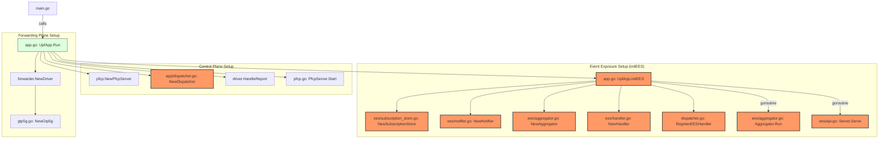
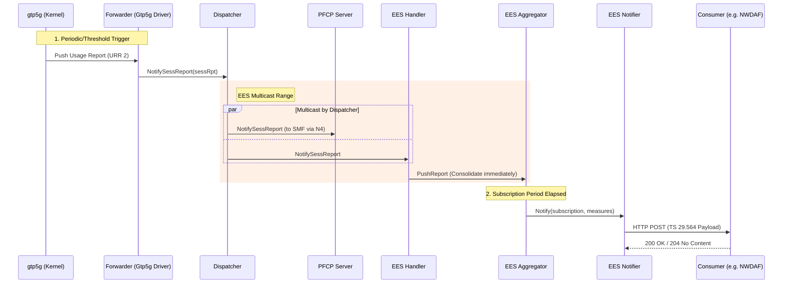

# GO-UPF Architectural Design and Event Exposure Service

## Introduction
The **GO-UPF** is a high-performance User Plane Function (UPF) implementation for 5G Core networks, adhering to the **Control and User Plane Separation (CUPS)** architecture. It serves as the gateway between the Radio Access Network (RAN) and the Data Network (DN), managed by the Session Management Function (SMF) via the **N4 interface** using the **PFCP** protocol.

This document describes the internal software architecture, data processing flows, and the integration of the **Event Exposure Service (EES)**, which implements the **Nupf_EventExposure** service as defined in **3GPP TS 29.564**.

---

## Software Architecture
The system is divided into three primary layers: the Control Plane (PFCP), the Forwarding Plane (Driver), and the Event Exposure Plane (EES).

### Component Mapping
| Component | Logical Function | Implementation Path |
|-----------|------------------|---------------------|
| **PFCP Server** | Handles N4 signaling, session management, and URR/PDR/FAR provisioning. | `internal/pfcp/` |
| **Forwarder Driver** | Interface to the data plane (e.g., `gtp5g` kernel module). | `internal/forwarder/` |
| **Dispatcher** | Multicasts usage reports from Forwarder to PFCP and EES. | `pkg/app/dispatcher.go` |
| **EES Aggregator** | Consolidates usage reports and manages notification timing. | `internal/ees/aggregator.go` |
| **EES API Server** | Manages EES subscriptions via RESTful interface. | `internal/ees/api.go` |
| **EES Notifier** | Delivers 3GPP-compliant notifications to subscribers. | `internal/ees/notifier.go` |

---

## System Initialization Chain
The following diagram illustrates the sequence of function calls during the UPF startup process. Components highlighted in **Orange** represent new modules or significant modifications for the Event Exposure Service.

---

## Data Processing Flow: Life of a Usage Report
The following procedure and sequence diagram describe how traffic measurements are captured and exposed. Components in **Orange** are new EES-specific actors.

1.  **Provisioning Phase**: The SMF initiates a `Session Establishment/Modification Request`.
 The `PFCP Server` (`internal/pfcp/node.go:NewSess`) creates session contexts and provisions rules (PDR/URR) to the `Forwarder Driver`.
2.  **Detection & Measurement**: The `gtp5g` kernel module matches packets against PDRs and accumulates byte/packet counts in URRs.
3.  **Report Triggering**: Based on URR thresholds or periodic timers, the kernel pushes a `Usage Report` to the `Forwarder Driver`.
4.  **Dispatching**: The `Forwarder` (`internal/forwarder/gtp5g.go:HandleReport`) receives the report via Netlink and invokes `Dispatcher.NotifySessReport`.
5.  **Aggregation**: 
    *   The report is sent to `PFCP Server` for standard N4 reporting to SMF.
    *   Simultaneously, it is sent to `EES Handler` (`internal/ees/handler.go`), which invokes `Aggregator.PushReport`. This triggers an SEID lookup (`node.go:GetSessionContextUEIP`) and instant consolidation using `mergeMeasure`.
6.  **Exposure**: The `Aggregator` (`internal/ees/aggregator.go:TickOnce`), driven by a background ticker, consolidates reports for the subscription period and invokes the `Notifier`.
7.  **Delivery**: The `Notifier` (`internal/ees/notifier.go:Notify`) serializes the data into **TS 29.564 NotificationItem** format and performs an HTTP POST to the subscriber's URI.

---

## Event Exposure Service (EES) Design
The EES module utilizes a **Pure Push Model**, leveraging existing SMF-provisioned URRs (specifically URR 2 - Measurement After QoS Enforcement) to avoid redundant kernel overhead.

### 3GPP Compliance Status (TS 29.564)
| Feature | Compliance | Technical Detail |
|---------|------------|------------------|
| `USER_DATA_USAGE_MEASURES` | ✅ Full | Volume (Bytes/Packets) and Throughput (bps). |
| `PER_SESSION` Granularity | ✅ Full | Aggregated at the PDU Session level. |
| `PERIODIC` Reporting | ✅ Full | Respects subscriber-defined `reportPeriod`. |
| `ONE_TIME` Reporting | ✅ Full | Immediate report upon subscription. |
| `anyUe` Targeting | ✅ Full | Monitors all active sessions in the UPF. |

---

## Core Design Principles
1.  **CUPS Adherence**: Clear separation between signaling handling and data reporting.
2.  **Zero-Redundancy Measurement**: Reuses standard PFCP URRs for event exposure to minimize kernel-to-userspace context switches.
3.  **Thread-Safe Session Management**: Utilizes `sync.RWMutex` in `LocalNode` to handle concurrent session lookups and reporting safely.
4.  **Graceful Lifecycle Management**: The `UpfApp` manages the ordered shutdown of PFCP, EES, and Forwarder components to prevent data loss.

---

## Standards References
- **3GPP TS 29.564**: 5G System; User Plane Function Services; Stage 3.
- **3GPP TS 29.244**: Interface between the Control Plane and the User Plane nodes.
- **3GPP TS 23.501**: System architecture for the 5G System (5GS).
