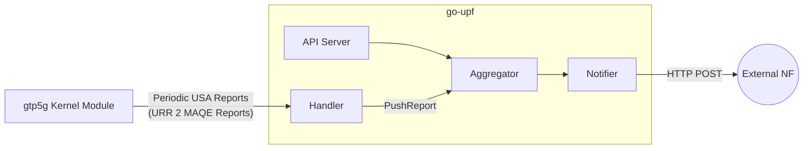
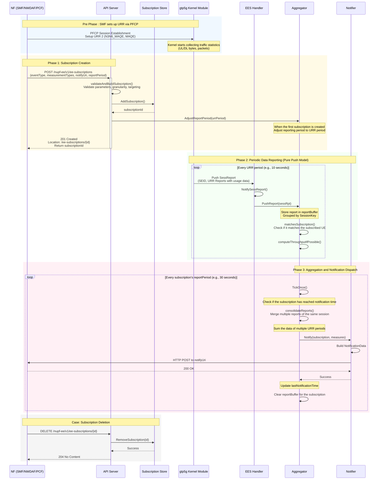

# UPF Event Exposure Service (EES)

This repository implements the **Nupf_EventExposure** service for `go-upf` per **3GPP TS 29.564**. It enables NFs (SMF, NWDAF, PCF) to subscribe to UPF events such as user data usage measurements.

---

## TS 29.564 Compliance Status

### Supported Features

| Feature | Status | Notes |
|---------|--------|-------|
| **Event Type** | | |
| `USER_DATA_USAGE_MEASURES` | ✅ Supported | Volume + Throughput |
| `USER_DATA_USAGE_TRENDS` | ⚠️ Partial | Schema only |
| `QOS_MONITORING` | ❌ Not Implemented | |
| `TSC_MNGT_INFO` | ❌ Not Implemented | |
| **Measurement Types** | | |
| `VOLUME_MEASUREMENT` | ✅ Supported | Bytes + Packets |
| `THROUGHPUT_MEASUREMENT` | ✅ Supported | Avg bps |
| `APPLICATION_RELATED_INFO` | ⚠️ Schema only | No DPI integration |
| **Granularity** | | |
| `PER_SESSION` | ✅ Supported | Default |
| `PER_APPLICATION` | ⚠️ API only | Requires DPI |
| `PER_FLOW` | ⚠️ API only | Requires DPI |
| **Reporting Trigger** | | |
| `PERIODIC` | ✅ Supported | Configurable period |
| `ONE_TIME` | ✅ Supported | Immediate report |
| **Targeting** | | |
| `anyUe: true` | ✅ Supported | All sessions |
| `ueIpAddress` | ✅ Supported | Specific UE |
| `supi` / `gpsi` | ❌ Not Implemented | |

### Subscription Response Example

When a subscription is created successfully, the API returns `201 Created` with a `Location` header and the following JSON body:

```json
{
  "subscriptionId": "sub-1738483200000000000-0000",
  "subscription": {
    "nfId": "smf-01",
    "eventList": [{
      "type": "USER_DATA_USAGE_MEASURES",
      "measurementTypes": ["VOLUME_MEASUREMENT", "THROUGHPUT_MEASUREMENT"],
      "granularityOfMeasurement": "PER_SESSION"
    }],
    "eventNotifyUri": "http://127.0.0.1:9000/callback",
    "notifyCorrelationId": "corr-session-001",
    "eventReportingMode": {"trigger": "PERIODIC", "reportPeriod": 30},
    "anyUe": true
  }
}
```

### Notification Payload (TS 29.564 Compliant)

The notification is sent as HTTP POST to the `eventNotifyUri`:

```json
{
  "notificationItems": [
    {
      "eventType": "USER_DATA_USAGE_MEASURES",
      "timeStamp": "2026-01-14T12:00:00Z",
      "ueIpv4Addr": "10.60.0.1",
      "startTime": "2026-01-14T11:59:30Z",
      "userDataUsageMeasurements": [
        {
          "volumeMeasurement": {
            "totalVolume": 1572864,
            "ulVolume": 524288,
            "dlVolume": 1048576,
            "totalNbOfPackets": 2000,
            "ulNbOfPackets": 800,
            "dlNbOfPackets": 1200
          },
          "throughputMeasurement": {
            "ulThroughput": "139810 bps",
            "dlThroughput": "279620 bps",
            "ulPacketThroughput": "26.67 pps",
            "dlPacketThroughput": "40.00 pps"
          }
        }
      ]
    }
  ],
  "correlationId": "corr-session-001"
}
```

**Note**: The fields included depend on the `measurementTypes` in the subscription:
- `VOLUME_MEASUREMENT` → includes `volumeMeasurement`
- `THROUGHPUT_MEASUREMENT` → includes `throughputMeasurement`

---

## Architecture

The EES uses a **Pure Push model** – SMF-provisioned URRs generate usage reports that are pushed from the kernel via Handler to the Aggregator. No Shadow URRs are created; we leverage existing SMF URR data.


#### Changing file in smf `smf/internal/contet/pfcp_rules.go` is required
```c
func NewVolumeThreshold(threshold uint64) UrrOpt {
        return func(urr *URR) {
                if threshold > 0 { //new logic
                        urr.ReportingTrigger.Volth = true
                        urr.VolumeThreshold = threshold
                }
        }
}
```

**Data Flow**:
1. SMF provisions URR 2 (N3N6_MAQE) for sessions via PFCP
2. Kernel pushes periodic USA reports to Handler
3. Handler calls `Aggregator.PushReport()` to buffer reports
4. Aggregator consolidates and dispatches notifications per subscription period

### Subscription to Notification Flow



---

## Configuration

In `upfcfg.yaml`:

```yaml
EES:
  Enabled: true
  ListenAddr: "0.0.0.0:8088"
  PeriodSec: 10
```
this new yaml feature is for callback url setting and the timer is for the data reporting interval. If the EES interval is smaller than the SMF URR interval, then the data will be rounded up to match the SMF URR interval.
---

## REST API

### Create Subscription

`POST /nupf-ee/v1/ee-subscriptions`

**Response**: `201 Created` with `Location` header containing the subscription URI.

### Delete Subscription

`DELETE /nupf-ee/v1/ee-subscriptions/{subscriptionId}`

**Response**: `204 No Content`

---

## Example Subscription Payloads

### 1. PER_SESSION (Default)

```bash
curl -X POST http://127.0.0.1:8088/nupf-ee/v1/ee-subscriptions \
  -H 'Content-Type: application/json' \
  -d '{
    "subscription": {
      "nfId": "smf-01",
      "eventList": [{
        "type": "USER_DATA_USAGE_MEASURES",
        "measurementTypes": ["VOLUME_MEASUREMENT", "THROUGHPUT_MEASUREMENT"],
        "granularityOfMeasurement": "PER_SESSION"
      }],
      "eventNotifyUri": "http://127.0.0.1:9000/callback",
      "notifyCorrelationId": "corr-session-001",
      "eventReportingMode": {"trigger": "PERIODIC", "reportPeriod": 30},
      "anyUe": true
    }
  }'
```

### 2. PER_APPLICATION (API validation only, requires DPI for data)

```bash
curl -X POST http://127.0.0.1:8088/nupf-ee/v1/ee-subscriptions \
  -H 'Content-Type: application/json' \
  -d '{
    "subscription": {
      "nfId": "nwdaf-01",
      "eventList": [{
        "type": "USER_DATA_USAGE_MEASURES",
        "measurementTypes": ["VOLUME_MEASUREMENT"],
        "granularityOfMeasurement": "PER_APPLICATION",
        "appIds": ["app-youtube", "app-netflix"]
      }],
      "eventNotifyUri": "http://127.0.0.1:9000/callback",
      "notifyCorrelationId": "corr-app-001",
      "eventReportingMode": {"trigger": "PERIODIC", "reportPeriod": 60},
      "anyUe": true
    }
  }'
```

### 3. PER_FLOW (API validation only, requires DPI for data)

```bash
curl -X POST http://127.0.0.1:8088/nupf-ee/v1/ee-subscriptions \
  -H 'Content-Type: application/json' \
  -d '{
    "subscription": {
      "nfId": "pcf-01",
      "eventList": [{
        "type": "USER_DATA_USAGE_MEASURES",
        "measurementTypes": ["VOLUME_MEASUREMENT"],
        "granularityOfMeasurement": "PER_FLOW",
        "trafficFilters": [
          {"flowDescription": "permit in ip from any to 10.0.0.0/8", "flowDirection": "DOWNLINK"}
        ]
      }],
      "eventNotifyUri": "http://127.0.0.1:9000/callback",
      "notifyCorrelationId": "corr-flow-001",
      "eventReportingMode": {"trigger": "PERIODIC", "reportPeriod": 10},
      "ueIpAddress": "10.60.0.1"
    }
  }'
```

### 4. ONE_TIME (Immediate Report)

```bash
curl -X POST http://127.0.0.1:8088/nupf-ee/v1/ee-subscriptions \
  -H 'Content-Type: application/json' \
  -d '{
    "subscription": {
      "nfId": "smf-01",
      "eventList": [{
        "type": "USER_DATA_USAGE_MEASURES",
        "measurementTypes": ["VOLUME_MEASUREMENT"]
      }],
      "eventNotifyUri": "http://127.0.0.1:9000/callback",
      "notifyCorrelationId": "corr-onetime-001",
      "eventReportingMode": {"trigger": "ONE_TIME"},
      "ueIpAddress": "10.60.0.1"
    }
  }'
```

---

## Validation Rules

| Condition | Requirement |
|-----------|-------------|
| `type = USER_DATA_USAGE_MEASURES` | `measurementTypes` is mandatory |
| `granularityOfMeasurement = PER_APPLICATION` | `appIds` is mandatory |
| `granularityOfMeasurement = PER_FLOW` | `trafficFilters` is mandatory |
| Targeting | Either `anyUe: true` OR `ueIpAddress` |
| `reportPeriod` (PERIODIC mode) | Must be ≥ URR period and a multiple of it |

---

## Key Files

| File | Purpose |
|------|---------|
| `internal/ees/api.go` | REST API handlers and subscription validation |
| `internal/ees/aggregator.go` | Report buffering, consolidation, and periodic dispatch |
| `internal/ees/handler.go` | Receives kernel URR reports and forwards to Aggregator |
| `internal/ees/notifier.go` | TS 29.564 payload construction and HTTP delivery |
| `internal/ees/subscription_store.go` | Thread-safe in-memory subscription management |
| `internal/ees/types.go` | Data structures and type definitions |

---

# Design decisions

| problems | solutions | results |
|------|---------|--------|
| 	We want to support as much granuality as possible, like session, application, flowbut the kernel only support URR packet accunmulation | Currently stopping at supporting per UE level with support of previous created URR configuration and periodic report pushing  |	The session report are pushed to the aggregator with URR interval without needed to have SMF to setup a new URR. |
| | |

---

## Future Work
* Add support for `USER_DATA_USAGE_TRENDS`
* Add support for `QOS_MONITORING`
* Add support for `TSC_MNGT_INFO`
* Add support for `PER_APPLICATION` and `PER_FLOW` using standalone mechanism
* Add support for `ONE_TIME`
* Add support for `supi` / `gpsi` (If smf supports)

---

## Standards References

- **3GPP TS 29.564** — Nupf_EventExposure API
- **3GPP TS 29.244** — PFCP (URR, Usage Reporting)
- **3GPP TS 29.512** — FlowInformation schema
