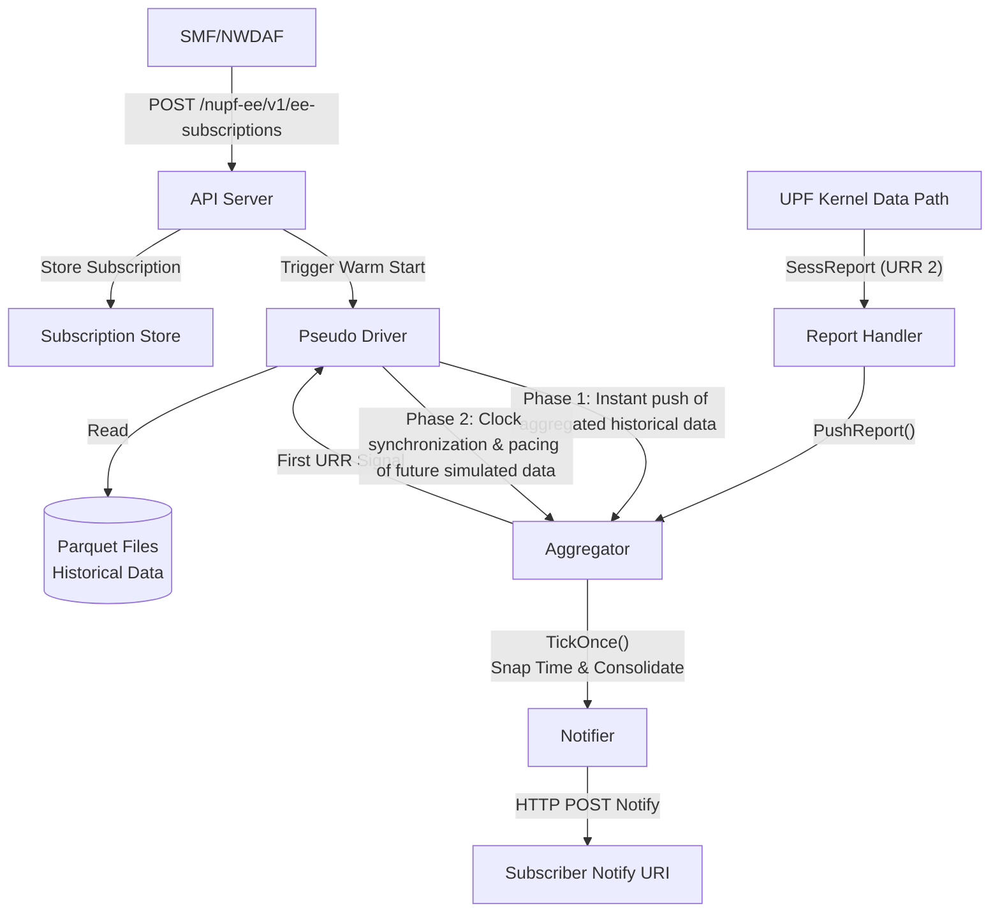

# UPF Event Exposure Service (EES) Design Document

This document details the overall operation flow, architectural design philosophies, and implementation details of the core components for the Event Exposure Service (EES) in `go-upf`.

## 1. Overall Operation Flowchart

The following Mermaid flowchart illustrates the complete process, from subscription creation and historical data handling (Warm Start) to receiving and aggregating real-time Kernel data, and finally sending notifications:

---

## 2. Component Design Philosophies and Implementation Details

### 2.1 API Server (`api.go`)
- **Design Philosophy**: Provides a lightweight REST API interface compliant with the 3GPP TS 29.564 specification for external network functions (like SMF or NWDAF) to create and delete EES subscriptions.
- **Implementation Details**:
  - Currently implements the MVP scope, only accepting the `USER_DATA_USAGE_MEASURES` event type and `PER_SESSION` granularity.
  - Supports both `PERIODIC` and `ONE_TIME` (On-Demand) event reporting modes.
  - Validates the legality of subscription requests, e.g., the Report Period must be greater than or equal to the URR measurement period and essentially a multiple of it.
  - Upon successful subscription creation, if a `PseudoDriver` is configured, it asynchronously triggers `LoadAndReplay()` to perform the Warm Start. For `ON_DEMAND` mode, it immediately invokes `TickOnce()` in the Aggregator.

### 2.2 Aggregator (`aggregator.go`)
- **Design Philosophy**: Adopts a Pure Push model to collect traffic reports from the Kernel or the Pseudo Driver. It is responsible for converging and time-aligning scattered packets or usage reports based on subscription rules (Target, Granularity, Period).
- **Implementation Details**:
  - **Dynamic Ticker Synchronization**: Starts a periodic event loop via `Run()`. When the first URR (First live URR) is received from the Kernel, it actively realigns the Ticker to ensure the buffer is captured precisely after the Kernel updates, preventing unpredictable delays or misalignment.
  - **Data Alignment (Time Window Snapping)**: Seamlessly aligns all report times to the subscription's periodic grid using `GridAnchor` with perfect integer math to avoid 1-nanosecond boundary issues caused by floating-point errors.
  - **Data Convergence (Consolidate Reports)**: Merges reports based on UE IP and the aligned StartTime. Accumulates uplink/downlink bytes and packets within the same time window and recalculates Throughput (Bps/Pps).
  - **Push and Buffer Mechanism**: If the subscription period time hasn't elapsed, the data batch remains in the buffer; once the time is reached, the merged results are handed to the Notifier to be sent, and `LastNotify` is updated.

### 2.3 Pseudo Driver (`pseudodriver.go`)
- **Design Philosophy**: Designed to solve the pain point where machine learning or analytical models require massive historical data for initialization (Warm Start). This component acts as a simulated data source, reading past packet records directly from local Parquet files and translating them into legitimate EES notification streams.
- **Implementation Details**:
  - **Two-Phase Data Flow (Phase 1 & Phase 2)**:
    - **Phase 1 (Warmstart / Historical Burst)**: Aggregates and pushes historical data instantly to the Aggregator within milliseconds, without any blocking, allowing the model to instantly acquire the necessary historical background observations for training.
    - **Phase 2 (Parallel Future Simulation)**: Reads Parquet data past the "Breaking Time" and perfectly syncs with the Aggregator's real clock (Ticker) via `WaitForTick()`, playing it forward at real-time pacing.
  - **Signal Synchronization (SignalFirstURR)**: Once the Aggregator receives authentic packets from the Kernel, it sends a `FirstURRSignal` to the Pseudo Driver. The Pseudo Driver then captures this real-world time as the `GridAnchor`, enabling the timelines of historical and real traffic to dock perfectly.
  - **Memory Optimization**: Extracts only 5 essential columns (`ts`, `direction`, `len`, `action`, `ue_ip`) when reading Parquet files, avoiding parsing overhead caused by empty or null string columns.

### 2.4 Notifier (`notifier.go`)
- **Design Philosophy**: Acts as the data exporter, responsible for packaging the standardized data consolidated by the Aggregator into JSON format and sending it to the Callback URI configured by the subscriber.
- **Implementation Details**:
  - Translates the internal `UsageMeasures` into external-facing Notify Payloads (including `notifyCorrelationId`, `timeStamp`, `eventReports`, etc.).
  - Transmits via HTTP POST requests.

### 2.5 Subscription Store & Report Handler
- **Subscription Store** (`subscription_store.go`): Provides a thread-safe in-memory data structure (e.g., a map) enabling O(1) time complexity for the API to write to and the Aggregator to iterate and query all active subscription parameters.
- **Report Handler** (`handler.go`): Receives raw usage reports (USAReport) from the UPF core data plane. Its internal logic filters specifically for `URRID == 2` (belonging to N3N6_MAQE, representing accurate traffic after QoS enforcement) and then forwards it to the Aggregator via `PushReport()` for subsequent aggregation.
